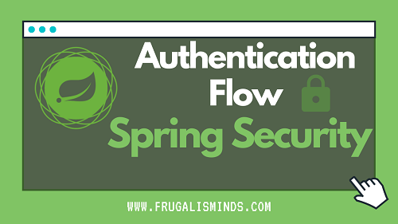

# 스프링 시큐리티  

</img>

## 학습 목차

#### 1. [스프링 시큐리티: 폼 인증](https://github.com/Junhan0037/spring-security/pull/1)

해당 repo는 [스프링 시큐리티 - 백기선](https://www.inflearn.com/course/%EB%B0%B1%EA%B8%B0%EC%84%A0-%EC%8A%A4%ED%94%84%EB%A7%81-%EC%8B%9C%ED%81%90%EB%A6%AC%ED%8B%B0) 해당 강의를 듣고 정리한 REPO 입니다.
